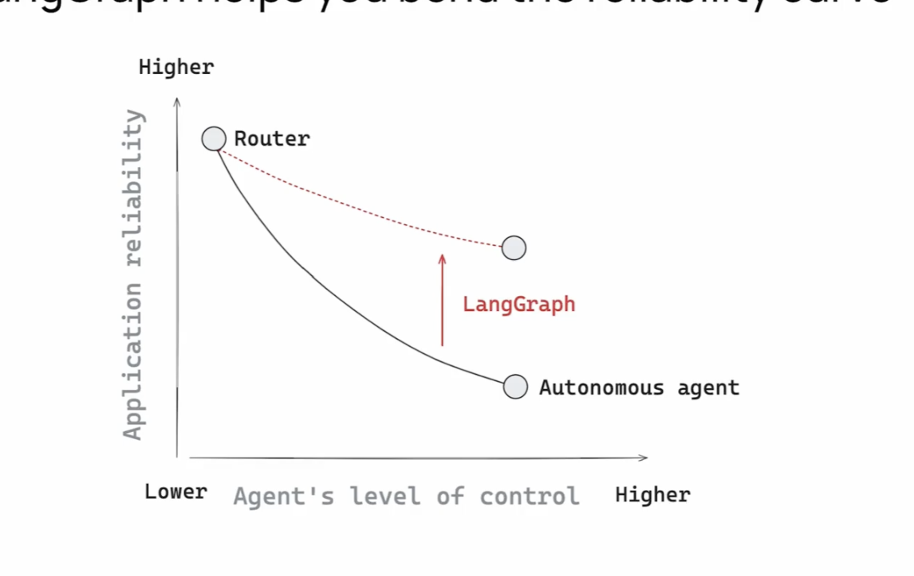
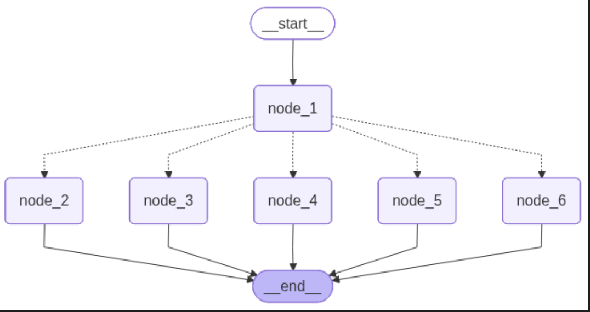
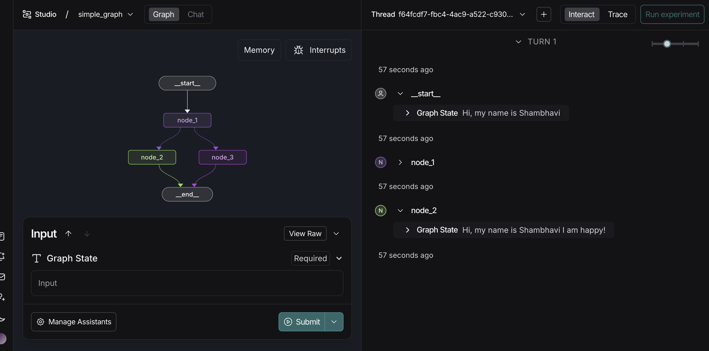

# Shambhavi-langgraph-MAT496
### Setup:
Followed the instructions in the README to create an environment and install dependencies.
## Module 1 
### Lesson 1-Motivation:
- Many LLM applications use control flow which forms a chain which is very reliable because they use same control flow every time.
- Agent is a control flow determined by an LLM  
- When we go from a simple agent (router) to complex (autonomous) the application reliability decreases and the level of control increases.

- We can balance reliability with langgraph
- Langgraph has persistance, streaming, human-in-the-loop and controllability.
- Langgraph comes with an IDE which helps you visualise and debug the agents that you build.
- Towards the end of the video, modules and their overview has been discussed.

### Lesson 2-Simple Graph:
- We build a simple graph with 3 nodes and one conditional edge.
- State is an object that we pass between the nodes and edges of the graph
- Edges connect the nodes
- We use if statement to execute the conditional state between node 2 and 3 by defining 50-50 probablity of both.
- When **invoke** is called, graph starts execution from START node and the conditional node will traverse from node 1 to node 2 or 3 using the 50/50 decision rule.
**Tweaking**: I used the same logic as explained in the video to make a graph corresponding to the problem statement-How much CGPA did I get.

### Lesson 3- Langsmith Studio
- Explains how to setup langsmith studio for viewing and testing agents.
- To track the various runs of graphs we use thread section of the studio.
- Multiple inputs can be added in graph state to add nodes and form a graph.

 