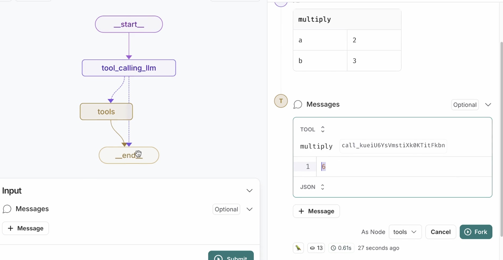
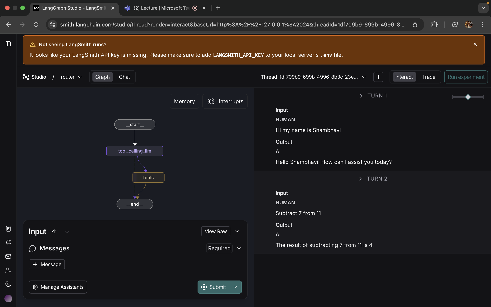
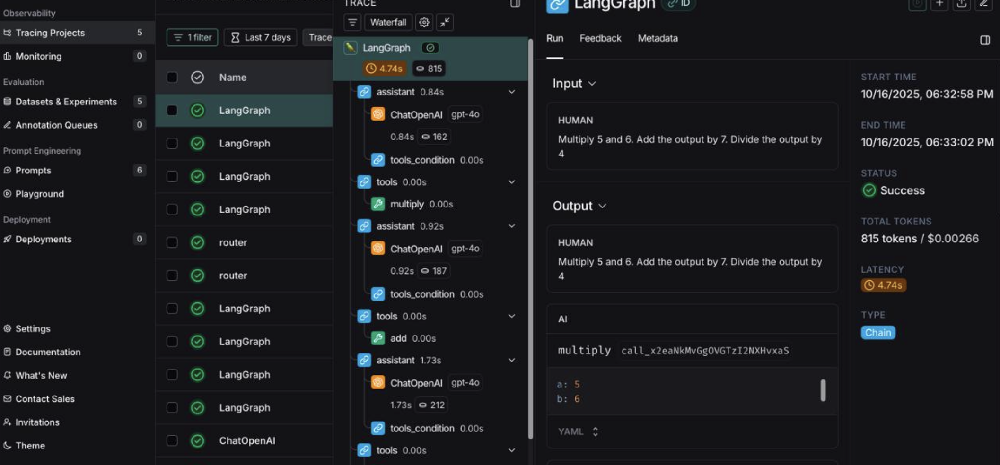
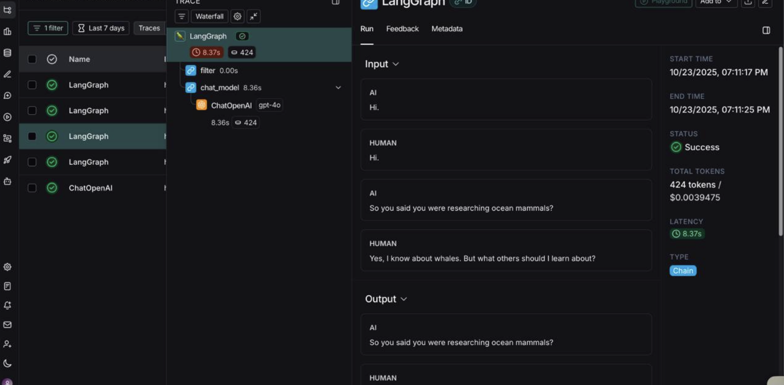
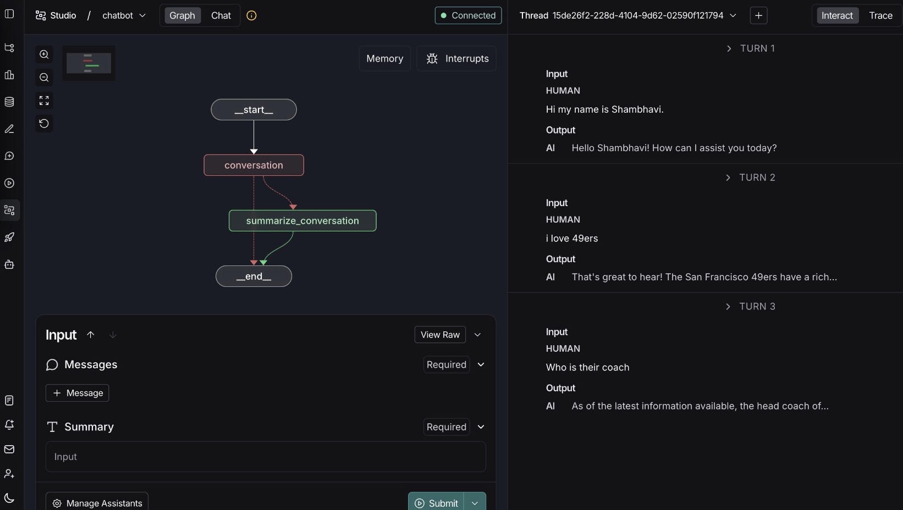
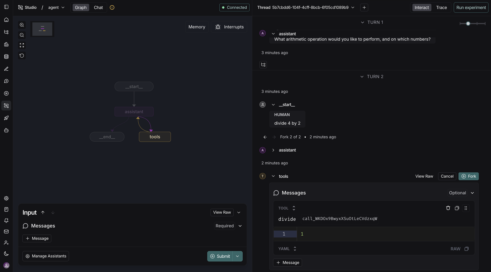
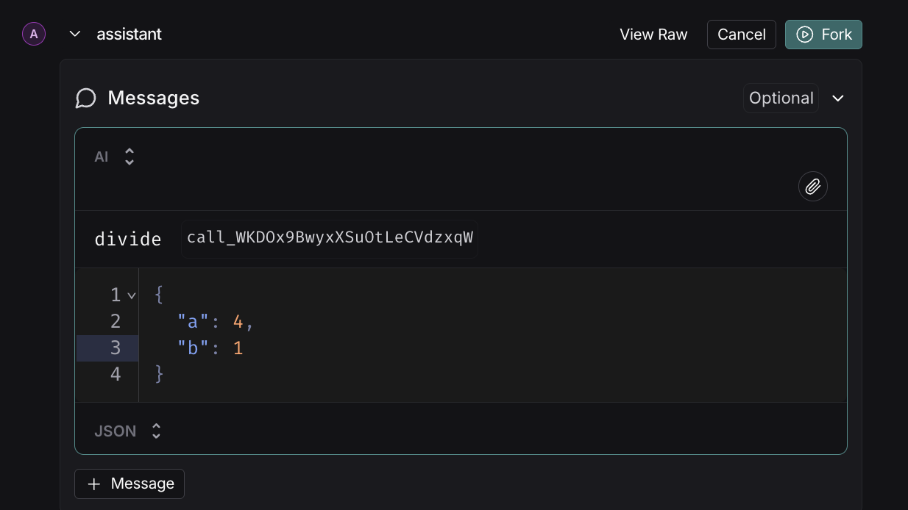
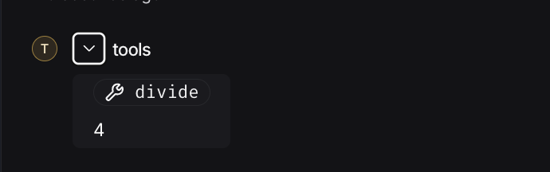

# Shambhavi-langgraph-MAT496
### Setup:
Followed the instructions in the README to create an environment and install dependencies.
## Module 1 
### Lesson 1-Motivation:
- Many LLM applications use control flow which forms a chain which is very reliable because they use same control flow every time.
- Agent is a control flow determined by an LLM  
- When we go from a simple agent (router) to complex (autonomous) the application reliability decreases and the level of control increases.

- We can balance reliability with langgraph
- Langgraph has persistance, streaming, human-in-the-loop and controllability.
- Langgraph comes with an IDE which helps you visualise and debug the agents that you build.
- Towards the end of the video, modules and their overview has been discussed.

### Lesson 2-Simple Graph:
- We build a simple graph with 3 nodes and one conditional edge.
- State is an object that we pass between the nodes and edges of the graph
- Edges connect the nodes
- We use if statement to execute the conditional state between node 2 and 3 by defining 50-50 probablity of both.
- When **invoke** is called, graph starts execution from START node and the conditional node will traverse from node 1 to node 2 or 3 using the 50/50 decision rule.
**Tweaking**: I used the same logic as explained in the video to make a graph corresponding to the problem statement-How much CGPA did I get.

### Lesson 3- Langsmith Studio
- Explains how to setup langsmith studio for viewing and testing agents.
- To track the various runs of graphs we use thread section of the studio.
- Multiple inputs can be added in graph state to add nodes and form a graph.

### Lesson 4- Chain:
- We build a simple chain that uses chat messages in our graph, uses chat models, binds tools to our LLM and executes tool calls in our graph.
- We can take a list of messages and pass it onto the chat model
- To connect our chat model to external tool like an API it requires a particular payload to run.
- To append a message use reducers.
- **Tweaking**: Made changes in the notebook, changed the datasets and tools to produce the corresponding graph.

### Lesson 5- Router:
- Router is a simple kind of agent which routes between response and tool calling 
- Conditional edge is going to look at the output and if that output is a tool call it will route to the tools node, otherwise it will just end.

- **Tweaking**: Changed the tool from multiplication to subtraction and changed the datasets.

### Lesson 6- Agent:
- We can turn router into a generic agent architecture.
- The model can either end or can pass the tool output back to he model.
- In the video they showed three sequential tool calls made by the agent.
- You can see the tracing of your project in langsmith, where it shows the various steps and process of your project. You can also check latency and token count.
**Tweaking**:

### Lesson 7- Agent with memory:
- Introduced memory in our agent 
- State is transient to single graph execution
- Graph- Control flow of nodes, edges.
- Each sequential node is a superstep whereas parallel nodes have common superstep
- Checkpoints contain the state of the graph at each step of the execution.
- Thread is a collection of checkpoints
- NLM is turned into a tool call which is passed to the tools node which provides the output and it goes back to the assistant in order to produce the output in Natural Language.
**Tweaking**:

## Module 2 

### Lesson 1- State schema:
- ⁠Learned how to manage state in LangGraph using TypedDict, dataclass, and Pydantic.
- Understood how to structure data for graph nodes and keep track of values across steps.
- Saw the difference between type hints and runtime validation, and how Pydantic helps catch invalid data.
- Practiced building a small graph where the agent can make decisions and update state dynamically.
- **Tweaks**:Added schema validation check and a utility function to display schema metadata.

### Lesson 2- State reducers:
- Learned how reducers in LangGraph let us control how state updates happen, especially when multiple nodes run at the same time.
- Explored built-in reducers like operator.add and add_messages, and also how to make custom reducers for tricky cases like None values.
- Practiced using reducers to combine data safely, add new messages, update existing ones, and even remove messages when needed.
- Saw how reducers help keep our state consistent and conflict-free in branching or parallel nodes.
**Tweaks**:Used average computation in state update, Gave graph example with merge node and altered logic,added validation logic in reducer and used more complex computation with scaling factor.

### Lesson 3- Multiple Schemas:
- From this lesson, I learned how we can use more than one schema in LangGraph instead of just one for the whole graph.
- Usually, all nodes share the same state for input and output, but that doesn’t always fit every situation.
- Sometimes, certain nodes need to exchange temporary or private data that isn’t needed in the final output.
- In those cases, we can use a private state schema to handle that internal data.
- This makes the graph cleaner and more efficient, since we can separate what’s just internal from what actually matters in the overall result.
**Tweaks**:Added Simple state modification with mild logic change, simple graph with two connected nodes,basic conditional logic in reducer,simple arithmetic and printing for clarity.

### Lesson 4- Trim filter messages:
- Learned how to manage and organize chat messages in LangGraph.
- Understood how to filter and trim messages to keep only important parts of a conversation.
- Learned to customize graph state schemas to control how data is stored and passed.
- Understood custom state reducers for updating conversation state.
- Used LangSmith for tracing and monitoring model behavior.

**Tweaks**:Revised dataset with different characters and tone, added new trimming function with a different name and argument order, added a selective filter function and combined both filters and trimmer in one wrapper.

### Lesson 5- Chatbot summarization:
- The lesson showed how a chatbot can remember past conversations by creating short summaries instead of storing full chat history.
- It explained how summarization helps keep context while reducing token usage and improving speed.
- It demonstrated how LangChain and LangGraph work together to manage conversation flow and memory.
- The concept of running summaries made it easier for the chatbot to handle long, continuous interactions.
- Overall, the lesson highlighted how memory and summarization make chatbots feel more intelligent, efficient, and human-like in conversation.
**Tweaks**:Createrd new sample chat (different characters and conversation tone),new summarization function name + small logic tweak and generated summary for the sample data.

### Lesson 6- Chatbot external memory:
- Chatbot can store and recall past conversations using an external database like SQLite.
- Memory persists across restarts, unlike temporary in-memory storage.
- LangGraph checkpointers allow saving and retrieving important information.
- Combines message summarization with database memory to maintain context efficiently.
- Makes the chatbot smarter, more reliable, and capable of long-term understanding.

**Tweaks**:Added message timestamping and automatic session creation,showed how messages are added, retrieved, and filtered to resemble an active chat session.

## MODULE 3

### Lesson 1- Streaming:
Learned how streaming responses are generated step-by-step and how interruptions or pauses can be handled during a conversation flow. Also understood the concept of thread configuration and how it helps manage separate conversation sessions while executing state-based logic in real time.
**Tweaks**:Updated the example prompt from Multiply 2 and 3 to Add 10 and 20.

### Lesson 2- Breakpoints:
Breakpoints let us pause a graph’s execution at certain nodes to observe data flow and intermediate outputs. They make debugging and testing easier by allowing us to inspect the graph’s state and then continue execution without restarting. Overall, it’s a clear and efficient way to understand and refine how the graph runs step by step.
**Tweaks**:Updated the example prompt from Multiply 2 and 3 to Add 5 and 10.

### Lesson 3- Editing State and Human Feedback 
LangGraph lets us edit a graph’s state using human feedback without rerunning the whole flow. We can directly modify node outputs or messages, then resume execution from that point. It makes debugging and refining results much faster and more flexible.
**Tweaks**:Updated the example prompt from Multiply 2 and 3 to Add 5 and 10.

### Lesson 4- Dynamic Breakpoints:
Dynamic breakpoints let us pause a graph’s execution only when certain conditions are met. Instead of stopping at fixed points, they adapt based on the data or logic being processed. This makes it easier to focus on specific parts of the workflow, analyze how the graph behaves in real situations, and debug issues more precisely without interrupting the entire flow.
**Tweaks**:Changed variable name and generated corresponding result

### Lesson 5- Time Travel:
Time travel in LangGraph lets us go back to a previous point in the graph and pick up from there. Instead of running the whole graph again, we can revisit an earlier state, check what went wrong or what changed, and then continue from that point. It’s a really practical way to debug, test different outcomes, and fine-tune how the graph works without wasting time re-running everything.
**Tweaks**: Changed multiplication to division (4 by 2) and made necessary modifications to fork and get different outputs in the tools section.

Added another example (4 divided by 1) to show changes in assistant and tools section

